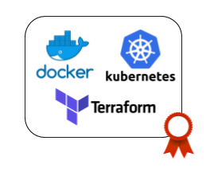

# Containers & IAC

 
 

### Motivation ###

Containers are fundamentally changing the way we develop, distribute, and run software. Developers can build software locally, knowing that it will run identically regardless of host environment—be it a rack in the IT department, a user’s laptop, or a cluster in the cloud. Operations engineers can concentrate on networking, resources, and uptime and spend less time configuring environments and battling system dependencies. The use and uptake of containers is increasing at a phenomenal rate across the industry, from the smallest start ups to large-scale enterprises. Developers and operations engineers should expect to regularly use containers in some fashion within the next few years. Containers are an encapsulation of an application with its dependencies. At first glance, they appear to be just a lightweight form of virtual machines (VMs)—like a VM, a container holds an isolated instance of an operating system (OS), which we can use to run applications. **Docker** took the existing Linux container technology and wrapped and extended it in various ways—primarily through portable images and a user-friendly interface—to create a complete solution for the creation and distribution of containers.

**Kubernetes** is an open source orchestrator for deploying containerized applications. Kubernetes was originally developed by Google, inspired by a decade of experience deploying scalable, reliable systems in containers via application-oriented APIs. There are many reasons why people come to use containers and container APIs like Kubernetes, but they effectively all can be traced back to one of these benefits:
- Velocity
- Scaling (of both software and teams)
- Abstracting your infrastructure
- Efficiency

On the other hand, Software is not done when the code is working on your computer. It’s not done when the tests pass. And it’s not done when someone gives you a “ship it” on a code review.
Software isn’t done until you deliver it to the user. Software delivery consists of all the work you need to do to make the code available to a customer, such as running that code on production servers, making the code resilient to outages and traffic spikes, and protecting the code from attackers.
The idea behind **Infrastructure as Code (IAC)** is that you write and execute code to define, deploy, and update your infrastructure. This represents an important shift in
mindset where you treat all aspects of operations as software—even those that aspects that represent hardware (e.g. setting up physical servers). In fact, a key insight of
DevOps is that you can manage almost everything in code, including servers, databases, networks, log files, application configuration, documentation, automated tests,
deployment processes, and so on.

### What you will learn ###

Application dockerization, deployment and replication with Kubernetes and automation with IaC using Terraform.

### Courses ###

#### Docker

1. [Acamica Docker Training](https://globant.acamica.com/cursos/128/introduccion-a-docker)

2. [Official Docker Get Started](https://docs.docker.com/get-started/)

#### Kubernetes

3. [Tutorials: Kubernetes](https://kubernetes.io/docs/tutorials/)

#### Terraform

4. [Studio presentation](https://drive.google.com/file/d/1ZSLyaDVLRh03ZRKmP1YRxl7t-NWsznb7/view)

5. [Linkedin course](https://www.linkedin.com/learning/topics/terraform)

6. [Hashicorp Getting Started](https://learn.hashicorp.com/terraform/#getting-started)

### Practice ###

#### Before you begin ####

- Install Docker (engine, compose, swarm). You can also try [Play with Docker](https://labs.play-with-docker.com/) to use it interactively.

- Install terraform (you can also use it through Docker)

- Install Kubernetes (you can use minikube). You can also try [Labs play with k8s](https://labs.play-with-k8s.com/).

#### Exercices ####

1. Dockerize a previously developed python app
- Create a Dockerfile for your app
- Create a docker-compose.yml file with your app and with an interacting db
- Provide db credentials to your app through Environment variables (directly or through a properties file)
- Test your dockerization locally.

2. Using Kubernetes, deploy the dockerized app from the previous exercice. Create at least 3 replicas of the app and limit the amount of resources each container can consume. Investigate how to monitor your cluster health, including general metrics (cpu/mem), container specific metrics, etc. 

3. Find a way to programatically break your application through an exposed endpoint. Check how Kubernetes reacts. How many replicas are left after hitting this endpoint? Which is their state? Does this change after some minutes? 

4. Create a terraform script with GCP as the provider which creates a Compute Engine instance
- Compute Engine instance type, storage features, zones and every other configuration must be parametrized through variables with default values.
- Test the script with your GCP account

5. Using your terraform script from **2**, deploy the dockerized app from **1** in your new Compute Engine instance and test the integration.

6. GKE. Check its features and try to set up your own cluster in GCP with previously dockerized application replicated in several nodes of your cluster.

### Commit ###

Commit your practice code.

### Auto assessment ###

*1. What are the advantages of using Docker? How is this related with the 'It worked on my machine!' sentence?*

*2. What is the difference between a Docker image and a Docker container? How do you build an image? How do you run a container?*

*3. Cache in Docker. How can you leverage it? What are image layers?*

*4. What is a Dockerfile? Which instructions do you know? What is the difference between ADD and COPY?*

*5. What is the purpose of Docker Compose? Which is its main file and how does it differ from Dockerfile?*

*6. Multi-stage build. What is it? Which are its main advantages? Develop an example with Python.*

*7. Networking. Which are the different available drivers? Which is the default driver? Can you create custom networks? Is it worth it? What are aliases?*

*8. Which are the requisites to access a docker container from another container running in the same host? How would you refer a container from the other?*

*9. How do you manage data in Docker? List the different options. At which stage (compile/run time) can you define the mount? How? Provide examples.*

*10. Regarding clustering, scheduling, replication... How do you manage a group of containers? Which are the different available tools and how do they differ?*

*11. Which are the advantages of using Kubernetes over standalone Docker?*

*12. Kubernetes vs Docker Swarm. List the differences. Which of them is the most used?*

*13. Explain the following Kubernetes features with examples: abstraction, declarative, immutable*

*14. What are PODs? Explain what an example POD of your dockerized application would contain. How many PODs can be placed on the same machine? What is the difference with jobs?*

*15. How is security handled in Kubernetes? What are roles?*

*16. Kubectl. List some of its commands and explain them*

*17. How does Kubernetes schedules its objects?*

*18. Investigate what the following components are: kubelet, Kubernetes API server, Kube-DNS, Kubectl, Metrics Server and Metrics API, Web UI*

*19. How would you debug your cluster?*

*20. Health checks. Investigate how to apply them. What is the difference between livenessProbe and readinessProbe?*

*21. What is the concept of IaC and which are its advantages? Which are its different levels? What is the difference between Terraform and Ansible?*

*22. Which is the terraform scripts language?*

*23. Explain the following Terraform features with examples: transparency, immutability, declarative, masterless, agentless*

*24. Which are the different Terraform remote operations? Do they generate any files (locally or remotely) when being run?*

*25. How can terraform scripts be safely executed by different users in different locations and concurrently? Investigate remote state*

*26. What are terraform modules? How do they enhance your code?*

*27. Can these be programmed with HCL? if-statements, count, create before destroy, threshold*

*28. Can you test your Terraform code?*

*29. How can you integrate Terraform with your CI/CD pipeline?*

---

 

### *Sync to obtain your badge!*
 
Remember to sync with an Academy tutor to obtain your badge before continuing to the next module. This will also let you be sure you have acquired every needed concept. Complete the [Ending Module form](https://forms.gle/ukvWjKtoFYx4Kn8q7) before meeting with your tutor.