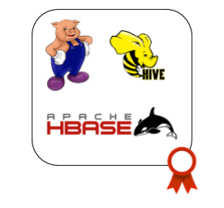

# Hadoop Ecosystem: Advanced

 

### Motivation ###

Demonstrate your expertise with the most sought-after technical skills. 
Big data success requires professionals who can prove their mastery with the tools and techniques of the Hadoop stack. 
A data engineer need to prove their core skills to ingest, transform, and process data using Apache Spark

### What you will learn ###

This course covers different aspects of Data engineering 
This course covers all aspects of the certification using Python as programming language.

Python Fundamentals:
* Core Spark - Transformations and Actions
* Spark SQL and Data Frames
* File formats in Hadoop
* Flume for Data Streaming
* Apache Sqoop
* Hive: Data Warehouse on top of Hadoop
* Hbase: NoSQL Database built on Hadoop

### Courses ###

**Mandatory:**

1. [Apache Sqoop for Beginners: Import & Export data from MySQL to HDFS](https://www.youtube.com/watch?v=r1NLCComQ9Q)
2. [Different Types of Files in Hadoop](https://www.youtube.com/watch?v=jKfKmBdPuT4)
3. [Data Streaming using Apache Flume](https://www.youtube.com/watch?v=fUesPFJ6FfE)
4. [HBase tutorial for Beginners](https://www.youtube.com/watch?v=V1fXSCASVDc)
5. [Hive tutorial for Beginners](https://www.youtube.com/watch?v=rr17cbPGWGA)
6. [Creating DataFrames In Spark](https://www.youtube.com/watch?v=UTpQxMtw58M)

**Optional:**
7. [Real-Time Data Pipelines Made Easy with Structured Streaming in Apache Spark](https://www.youtube.com/watch?v=wQfm4P23Hew&t=845s) (8h)

### Practice ###

#### Before you begin ####
It is assumed that Git is already installed and working.

Prerequisite Courses:
* [Hadoop Ecosystem: Fundamentals - Hadoop + MR](hadoop_ecosystem_fundamentals_1/)
* [Hadoop Ecosystem: Fundamentals - Spark](hadoop_ecosystem_fundamentals_2/)

#### Exercices ####

### Commit ###

Commit your practice code.

### Auto assessment ###

1. *What is a metastore in Hive?*
2. *Where does the data of a Hive table gets stored?*
3. *What is the difference between external table and managed table?*
4. *When should we use SORT BY instead of ORDER BY?*
5. *What is a partition in Hive?*
6. *Scenario:
Suppose, I create a table that contains details of all the transactions done by the customers of year 2016: CREATE TABLE transaction_details (cust_id INT, amount FLOAT, month STRING, country STRING) ROW FORMAT DELIMITED FIELDS TERMINATED BY ‘,’ ;
Now, after inserting 50,000 tuples in this table, I want to know the total revenue generated for each month. But, Hive is taking too much time in processing this query. How will you solve this problem and list the steps that I will be taking in order to do so?*
7. *Why do we need buckets?*
8. *What is indexing and why do we need it?*
9. *Scenario:
Suppose, I have a lot of small CSV files present in /input directory in HDFS and I want to create a single Hive table corresponding to these files. The data in these files are in the format: {id, name, e-mail, country}. Now, as we know, Hadoop performance degrades when we use lots of small files.
So, how will you solve this problem where we want to create a single Hive table for lots of small files without degrading the performance of the system?*
10. *What is an Apache HBase?*
11. *What are the key components of HBase?*
12. *What is WAL in HBase?*
13. *What are the differences between the Relational database and HBase?*
14. *Define the difference between Hive and HBase?*
15. *Explain the data model of HBase*
16. *What is the use of Apache Sqoop in Hadoop?*
17. *What is the default file format to import data using Apache Sqoop?*
18. *Name a few import control commands. How can Sqoop handle large objects?*
19. *How can you avoid importing tables one-by-one when importing a large number of tables from a database?*
20. *How can you control the number of mappers used by the sqoop command?*
21. *What do you understand by the Parquet file?*
22. *Can you explain how to minimize data transfers while working with Spark?*
23. *Please provide an explanation on DStream in Spark.*
24. *What are the different levels of persistence in Spark?*
25. *What is SparkSession?*
26. *How Can You Minimize Data Transfers When Working With Spark?*
27. *What Is Catalyst Framework?*
28. *What Is A Parquet File?*
29. *How Sparksql Is Different From Hql And Sql?*

---

## Additional resources

* [Hadoop - The Definitive Guide - O’Reilly](https://www.oreilly.com/library/view/hadoop-the-definitive/9781491901687/)
* [Spark - The Definitive Guide - O’Reill](https://www.oreilly.com/library/view/spark-the-definitive/9781491912201/)
* [Designing Data-Intensive Applications](https://www.oreilly.com/library/view/designing-data-intensive-applications/9781491903063/)

---

 

### *Sync to obtain your badge!*
 
Remember to sync with an Academy tutor to obtain your badge before continuing to the next module. This will also let you be sure you have acquired every needed concept. Complete the [Ending Module form](https://forms.gle/ukvWjKtoFYx4Kn8q7) before meeting with your tutor.