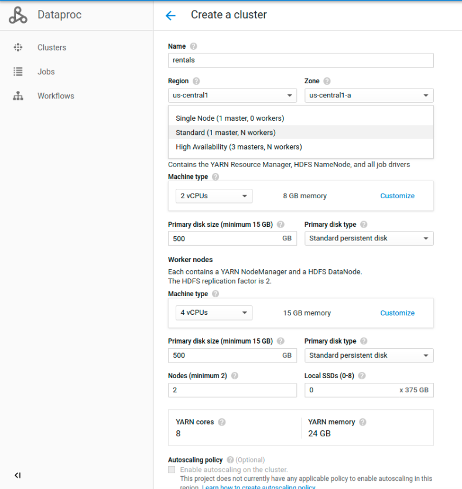
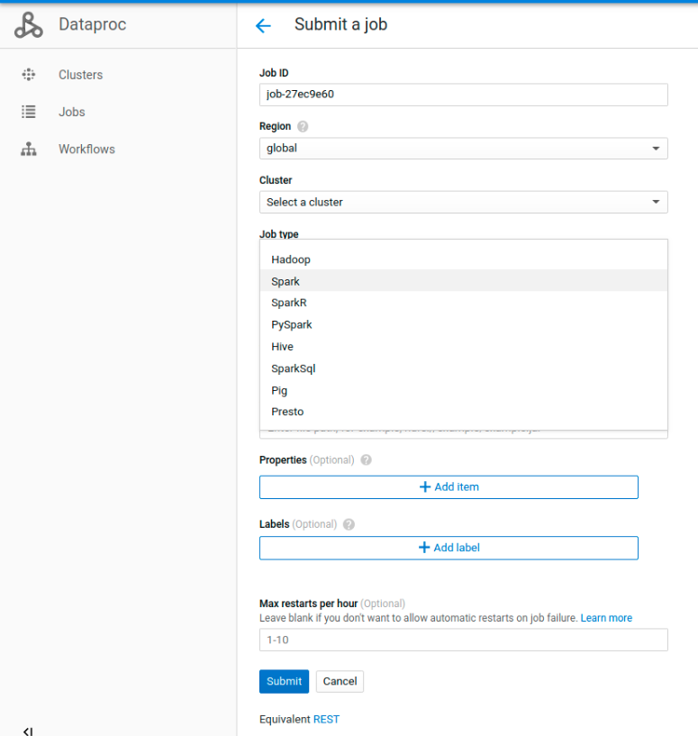
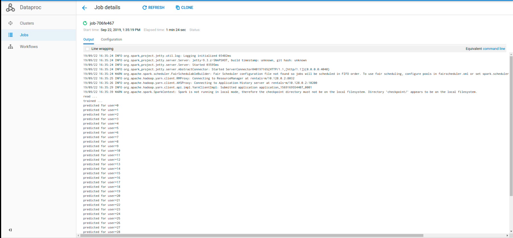

# Hadoop Ecosystem: Fundamentals - Hadoop + MR

<p align="center"> 
 
</p>

### Motivation ###
The Apache Hadoop software library is a framework that allows for the distributed processing of large data sets across clusters of computers using simple programming models. It is designed to scale up from single servers to thousands of machines, each offering local computation and storage. It is the foundation of the US$166B Big Data ecosystem (source: IDC) by enabling data applications to run and be managed on large hardware clusters in a distributed computing environment. Besides, it has been at the center of this big data transformation, providing an ecosystem with tools for businesses to store and process data on a scale that was unheard of several years ago.

### What you will learn ###

- Understand how to analyze problems and drive to solutions using data.
- The Hadoop main concepts and architecture
- HDFS Fundamentals
- Map Reduce Essentials

### Courses: ###

**Mandatory:**

1. [Intro to Data Analysis](https://www.udacity.com/course/intro-to-data-analysis--ud170)
- Mandatory Lession 1: Data Analysis Process

2. [Intro to Hadoop and MapReduce](https://www.udacity.com/course/intro-to-hadoop-and-mapreduce--ud617)
- Mandatory modules: Big Data, HDFS and MapReduce, Problem Set Lesson 2 & Lesson 4

**Extra:**

4. [Introduction to Apache Hadoop](https://www.edx.org/course/introduction-apache-hadoop-linuxfoundationx-lfs103x)
- Recommended Chapters: 2, 3

5. [Big Data and Hadoop Essentials](https://www.udemy.com/big-data-and-hadoop-essentials-free-tutorial/) (45mins)

6. [Hadoop Basic Course for Beginners to Professionals](https://www.udemy.com/hadoop-basic-course-for-beginners-to-professionals/) (2.5h)

### Reading: ###

7. [MapReduce in detail](../reading/mr_in_detail.pptx)

### Practice: ###

#### Before you begin ####
(It is assumed that Git is already installed and working).

### Set up Cloud Dataproc ###

Cloud Dataproc is a fast, easy-to-use, fully managed cloud service for running Apache Spark and Apache Hadoop clusters in a simpler, more cost-efficient way. Operations that used to take hours or days now complete in seconds or minutes instead, and you pay only for the resources you use (with per-second billing). Cloud Dataproc also easily integrates with other Google Cloud Platform (GCP) services, giving you a powerful and complete platform for data processing, analytics, and machine learning.

In order to work on your Hadoop MR and Spark exercices, set up your own Dataproc cluster, which will count with every needed libraries and dependencies to run your code. 

<p align="center"> 
 
</p>

Choose a Standard cluster. For machine type, choose the smallest instance both for master and slave nodes to start with and scale it only if needed.

Once you have your cluster up, to submit a new job you will need to go to the Jobs tab and select the job type.

<p align="center"> 
 
</p>

You can then inspect yor job details and logs and check whether the job has been successfully completed or not.

<p align="center"> 
 
</p>

In case you need to modify a file which has already been copied into GCP, you can edit it online with CloudShell:
```
$ cloudshell edit hadoop_mr_job.py
```

#### Pricing

**Important!!** Mind that Dataproc cluster is expensive (you're charged based on the size of Cloud Dataproc clusters and the duration of time that they run). Here are some good practices you can follow to save costs:
- We strongly suggest you (not only for this component but also for every service you'll be using in the cloud) to shut down the cluster while you're not using it. 
- Check [scheduled deletion](https://cloud.google.com/dataproc/docs/concepts/configuring-clusters/scheduled-deletion) if you want to automatically delete your cluster when not being used.
- Use [Preemptible VMs](https://cloud.google.com/dataproc/docs/concepts/compute/preemptible-vms) in your cluster.
- For further details on Dataproc pricing, check [this](https://cloud.google.com/dataproc/pricing). 

#### Additional reading

[Migrating On-Premises Hadoop Infrastructure to Google Cloud Platform](https://cloud.google.com/solutions/migration/hadoop/hadoop-gcp-migration-overview)

#### Exercices ####

1. ETL: Movies data processing

Process the 5000 films data file extracted from IMDB and answer the questions below. Show obtained results in a simple HTML document. Additionaly, add the time that takes to process the data to achieve requirements.

- ¿How many "colour" films and how many "black and white" films are there in the list?
- ¿How many films did each director produce?
- ¿Which are the 10 least criticized films?
- ¿Which are the 20 longest films?
- ¿Which are the 5 films which raised the most money?
- ¿Which are the 5 fils which raised the least money?
- ¿Which are the 3 movies which spent the most to be produced?
- ¿Which are the 3 movies which spent the least to be produced?
- ¿In which year were more films released?
- ¿In which year were less films released?
- Create a ranking of actors including the following:
  - amount of movies where the actor performed
  - his/her influence in social networks
  - his/her best movie
  - ordered by number of performances

- Create a tag cloud using movies tags or keywords. To do this, is enough with creating and showing a word ranking and its weight (number of appareances of the word), with descending order.

- ¿Which movie gender raised the most for each year?
- ¿Which movie gender raised the least for each year?
- Show the actors ranking ordered by performances and popularity
- ¿Which movie genre do people like the most?
- ¿Which are the 5 directors with the best reputation?

Do not use the pandas package to make this implementation. Restrict to the Standard Library.

[Films data file](https://drive.google.com/open?id=0B7BCSacG-KJgUE1YRW9wUEQwUDQ)

2. Udacity - Lesson 2

3. Udacity - Lesson 4

### Commit ###

Commit your practice code.


### Auto assessment ###

*1. Please indicate the phases for Data Analysis Process?*

*2. What are the main components of a Hadoop Application?*

*3. What are the 2 parts that divide the Wrangling phase?*

*4. Data locality feature in Hadoop means ?*

*5. The phase that allows us to make predictions with the data is?*

*6. Which are the three modes in which Hadoop can be run?*

*7. What happens to job tracker when Namenode is down?*

*8. What is the basic difference between traditional RDBMS and Hadoop?*

*9. How would you transform unstructured data into structured data?*

*10. Replication causes data redundancy, then why is it pursued in HDFS?*

*11. What is a Namenode?*

*12. What is a Datanode?*

*13. What are Problems with small files and HDFS?*

*14. Can Hadoop handle streaming data?*

*15. In Hadoop, HDFS federation means?*

*16. What are the scheduler options available in YARN?*

*17. What is a block in HDFS?*

*18. Explain how do ‘map’ and ‘reduce’ works.*

*19. What are the common input formats in Hadoop?*

*20. What is the use of jps command in Hadoop?*

---

 

### *Sync to obtain your badge!*
 
Remember to sync with an Academy tutor to obtain your badge before continuing to the next module. This will also let you be sure you have acquired every needed concept. Complete the [Ending Module form](https://forms.gle/ukvWjKtoFYx4Kn8q7) before meeting with your tutor.