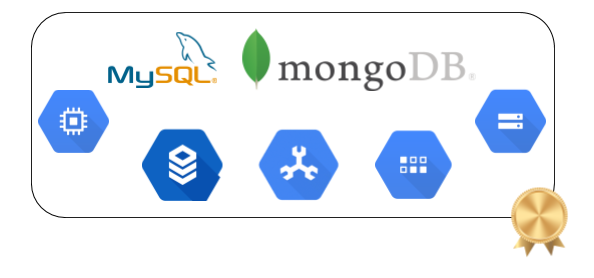

# Introduction to Data Models

<p align="center"> 
 
</p>

### Motivation ###

Chosing the most appropriate data model for your project is not trivial. As a DA, you are expected to be able to define what are the pros and cons of each model for your use case and make the final choice.

### What you will learn ###

To begin with, we can classify data models in two big groups: relational and NoSQL databases. Here you will learn the fundamentals of each, with some specific implementations details.

### Courses: ###

1. [Intro to Relational Databases](https://www.udacity.com/course/intro-to-relational-databases--ud197)
- Mandatory modules: Elements of SQL, Python DB API, Deeper into SQL

2. [NoSQL - Acamica](https://globant.acamica.com/cursos/412/)

### Reading: ###

3. [NoSQL Fundamentals Guide](https://docs.google.com/document/d/1d8DYf6F9p74Cm5hvPwo6njdGazu01y4sqZG1mmIxLWY/edit)

4. [Data models choice](../reading/data_models_choice.pptx)

→ [index](#index)

### Before you begin: ###

You will solve this exercices using [Google Cloud SQL](https://cloud.google.com/sql/docs/). Check out the [pricing details](https://cloud.google.com/sql/pricing) to spend as little as possible (*Despite not being necessary for this exercice, [Google Cloud Spanner](https://cloud.google.com/spanner/) is pretty cool. Have you checked it out? When would you choose it?*)

Jump over to the SQL section of the Cloud Console in your browser. Once there, click on the button to create a new
instance, which is analogous to a server in regular MySQL-speak. Be sure to pick a region that’s nearby, so your queries won’t be traveling around the world and back. Once you click Create, Google will get to work setting up your Cloud SQL instance.

Before talking to your database, you need to make sure you have access. MySQL uses password authentication, so to grant additional access, all you have to do is create new users. You can do this inside the Cloud Console by clicking on the Cloud SQL instance and choosing the Users tab. Here you can create a new user or change the root user’s password, but make sure you
keep track of the username and password that you create.

You can check your instances with *gcloud*:

```
$ gcloud sql instances list
NAME                REGION    TIER              ADDRESS       STATUS
da-academy-instance us-east1  db-n1-standard-1  104.196.23.32 RUNNABLE
```

You can also connect to your instance with the regular *my-sql* client:
```
$ sudo apt-get install mysql-client
...
$ mysql -h 104.196.23.32 -u user-here --password=password-here
Welcome to the MySQL monitor. Commands end with ; or \g.
Your MySQL connection id is 37
Server version: 5.6.25-google (Google)
...
```

Create a *high-school* database to be able to solve the exercices in the following section.

### Practice: ###

1. Using previously created *high-school* database, modelate:

   - Student: first name, last name, registration number, date of birth
   - Teacher: first name, last name, date of birth
   - Course: name, assigned teacher, hours by week, schedule time (they can be dictated several times during the week)

   Notes:
   - A student can assist several courses during the same year.
   - A teacher can be assigned to several courses.
   - For each course, each student has 3 partial notes and a final note.
   - Create all relationship that you think they are required.

2. Insert information for 3 teachers, 3 courses and 10 students per course.
3. List students and teachers for a given course. The output format should be:

        Course: <course-name>
        Teacher: <last-name>, <first-name>
        Students:
          <last-name>, <first-name> (ordered by alphabetically by last name)

4. Percentage of students that passed/failed a given course.
5. For a given teacher, list the timeline for each course that he is assigned to (ordered by date), and the course name. The format should be:

        Teacher: <last-name>, <first-name>
        Schedule:
          Monday 09:00 - 11:00: <course-name>
          Monday 15:00 - 17:30: <course-name>
          Friday 08:45 - 10:40: <course-name>

6. Identify and Optimize all queries.

7. [NoSQL exercices](../exercices/MongoDB_Exercises.pdf) (Download [restaurants.zip](../exercices/restaurants.zip)). Choose GCP as the provider.

**Challenge!**

Instead of using the *Atlas* provider, use **[Google Cloud Datastore](https://cloud.google.com/datastore/)**. Try solving the previous exercises within this fully-managed service.
Use [this guide](../exercices/Datastore_Exercise.pdf) in order to configure environment.

#### Additional exercices ####

1. Exercies from [Udacity](https://www.udacity.com/course/intro-to-relational-databases--ud197)

2. Quiz - Acamica

#### Deploying to the Cloud ####

After having finished with your exercices, upload the SQL/BSON queries you have run (*.sql/text files*) to your Cloud Storage bucket within a folder called *Month_1*.

### Commit: ###

Commit your practice code.


### Auto assessment: ###

*1. What is a DBMS and what are its responsibilities? What are the DBMS components?*

*2. What are the architectural levels? How are they related to each other?*

*3. What are the characteristics of a OLAP system? What is the difference with OLTP?*

*4. What is ACID? Explain each concept of the acronym*

*5. Explain what is a data model, and what are the different structures, constraints and operations.*

*6. What is normalization, and what each level requires? Why would you normalize a table? How do you do it?*

*7. What is the difference between relational and non relational databases? Why would you chose each?*

*8. What are the different types of databases?*

*9. What does the CAP Theorem state? What are the tradeoffs one needs to do when selecting a database?*

*10. What are the Consistency levels?*

*11. Explain Sharding, Clustering and Partitions*

*12. What does failover mean? What are some failover techniques?*

*13. How do Key-Value stores work? What are the benefits? What are the weaknesses? What are some of the common features?*

*14. How do Documental stores work? What are the benefits? What are the weaknesses? What are some of the common features?*

*15. How do Columnar stores work? What are the benefits? What are the weaknesses? What are some of the common features?*

*16. How do Graph stores work? What are the benefits? What are the weaknesses? What are some of the common features?*

*17. What are the common architectural components and functions of the different data store types?*

---

 

### *Sync to obtain your badge!*
 
Remember to sync with an Academy tutor to obtain your badge before continuing to the next module. This will also let you be sure you have acquired every needed concept. Complete the [Ending Module form](https://forms.gle/ukvWjKtoFYx4Kn8q7) before meeting with your tutor.
