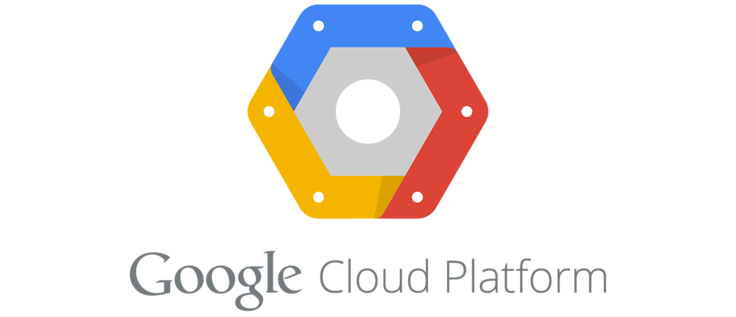

# Introduction: Cloud Ecosystem with GCP

<p align="center"> 
 
</p>

### Motivation ###

The term *“cloud”* has been used in many different contexts and it has many different definitions, so it makes sense to define the term at least for this course.

Cloud is a collection of services that helps developers focus on their project rather than on the infrastructure that powers it.

In more concrete terms, cloud services are things like Amazon Elastic Compute Cloud (EC2) or Google Compute Engine (GCE), which provide APIs to provision virtual servers, where customers pay per hour for the use of these servers.

In many ways, cloud is the next layer of abstraction in computer infrastructure, where computing, storage, analytics, networking, and more are all pushed higher up the computing stack. This structure takes the focus of the developer away from CPUs and RAM and toward APIs for higher-level operations such as storing or querying for data.
Cloud services aim to solve your problem, not give you low-level tools for you to do so on your own. Further, cloud services are extremely flexible, with most requiring no provisioning or long-term contracts. Due to this, relying on these services allows you to scale up and down with no advanced notice or provisioning, while paying only for the resources you use in a given month.

There are many cloud providers out there, including Google, Amazon, Microsoft, Rackspace, DigitalOcean, and more. With so many competitors in the space, each of these companies must have its own take on how to best serve customers. It turns out that although each provides many similar products, the implementation and details of how these products work tends to vary quite a bit.

In this course, we will focus on GCP.

### What you will learn ###

In this section, you will learn some of the basics of AWS and GCP, being able to fully understand, deploy and configure different components in the cloud.

### Courses: ###


###  Recommended Material
0. [Google Cloud Platform 101 (Google I/O '18)](https://www.youtube.com/watch?v=trJaoEtBh6w)

1. [GCP Fundamentals - Globant's GCP Internal Site](https://sites.google.com/globant.com/trainings/cloud-computing/gcp/learn-by-topic/gcp-fundamentals?authuser=0)

2. [Compute - Globant's GCP Internal Site](https://sites.google.com/globant.com/trainings/cloud-computing/gcp/learn-by-topic/compute?authuser=0)

3. [GCP Storage & Databases - Globant's GCP Internal Site](https://sites.google.com/globant.com/trainings/cloud-computing/gcp/learn-by-topic/storage-databases?authuser=0)

4. [Big Data - Globant's GCP Internal Site](https://sites.google.com/globant.com/trainings/cloud-computing/gcp/learn-by-topic/big-data?authuser=0)

5. [Machine Learning - Globant's GCP Internal Site](https://sites.google.com/globant.com/trainings/cloud-computing/gcp/learn-by-topic/machine-learning?authuser=0)

6. [Getting Started with with Google Cloud Platform - Playlist](https://www.youtube.com/watch?v=ujx-C2FO3_0&list=PLIivdWyY5sqI_-9KtGd4aEMu7gEO2ZWja)

7. [GCP Essentials - Playlist](https://www.youtube.com/watch?v=4D3X6Xl5c_Y&list=PLIivdWyY5sqKh1gDR0WpP9iIOY00IE0xL)

### Recommended Exercises

1. [Free Labs Intro](https://google.qwiklabs.com/focuses/2794?parent=catalog&utm_source=gcp&utm_campaign=freelabs&utm_medium=site)
    - A tour of Qwiklabs and the Google Cloud Platform
    - App Engine: Qwik Start - Python
    - BigQuery: Qwik Start - Command Line
    - Explore and Create Reports with Data Studio

2 - Python Bookshelf app using CloudSQL
    https://cloud.google.com/python/getting-started/tutorial-app

3 - Python Bookshelf app using Google Compute Engine
    https://cloud.google.com/python/tutorials/bookshelf-on-compute-engine


#### Extra Material
The site:
 [GCP Official training](https://cloud.google.com/training/)
 

#### Before you begin ####

GCP counts with several cloud products with different purposes, which you can check in https://cloud.google.com/products/. To make use of them, you first need to set up a GCP account.

##### Setting up a GCP account #####

Setting up an account on GCP is pretty self-explanatory.

1) Visit https://cloud.google.com/ and click the *Sign in* button on the right.
2) Enter your personal Google account credentials.
3) Click the blue *Console* button on the top right.
4) **Try Google Cloud Platform for free**. Click Sign up!
5) Accept the *Terms & conditions*.
6) Fill the personal information form.
7) That should be it. You can tour the console and scan where each service is available!

With your account, you get a 12-month free trial with $300 credit to use with any GCP services. It provides limited access to many common GCP resources, free of charge. You can find further details [in here](https://cloud.google.com/free/docs/gcp-free-tier).

##### Billing Alarm #####

As you know, GCP offers you a *pay-as-you-go* approach to help ensure you only pay for what you use on the software solutions you need. The idea of this course is not to waste any money, so, make a daily check on the *Billing Account overview* to monitor your remainin credits. You can also configure an option to send you regular e-mails with your account details.

### What will we use ###

After creating your GCP account, visit the [GCP Cloud Console](https://console.cloud.google.com/). Sign in and check the different GCP services. You will see different categories from which to choose, such as:

- Compute
- Storage
- Networking
- Stackdriver
- Big Data
- AI

During the course, you will need to use certain products from the above list. If you feel curious and want to try other categories out, ***go ahead!*** There is plenty of documentation available to guide you.

##### Installing the SDK #####

After you get comfortable with the Google Cloud Console, you’ll want to install the Google Cloud SDK. The SDK is a suite of tools for building software that uses Google Cloud, as well as tools for managing your production resources. In general, anything you can do using the Cloud Console can be done with the Cloud SDK, *gcloud*. To install the SDK, go to https://cloud.google.com/sdk/, and follow the instructions for your platform. For example, on a typical Linux distribution, you’d run this code:
```
$ export CLOUD_SDK_REPO="cloud-sdk-$(lsb_release -c -s)"
$ echo "deb http://packages.cloud.google.com/apt $CLOUD_SDK_REPO main" | sudo tee -a /etc/apt/sources.list.d/google-cloud-sdk.list
$ curl https://packages.cloud.google.com/apt/doc/apt-key.gpg | sudo apt-key add -
$ sudo apt-get update && sudo apt-get install google-cloud-sdk
```

After you have everything installed, you have to tell the SDK who you are by logging in. Google made this easy by connecting your
terminal and your browser:
```
$ gcloud auth login
Your browser has been opened to visit:
    [A long link is here]
    Created new window in existing browser session.
```
You can make any code you write in the future automatically handle authentication by using application default credentials. You can get these using the gcloud auth sub-command once again:
```
$ gcloud auth application-default login
Your browser has been opened to visit:
    [Another long link is here]
Created new window in existing browser session.
Credentials saved to file:
    [/home/jjg/.config/gcloud/application_default_credentials.json]
These credentials will be used by any library that requests
Application Default Credentials.
```

You can now interact with GCP using both the Cloud Console or the SDK.

### First project ###

When we first signed up for Google Cloud Platform, we learned that a new project is created automatically, and that projects have something to do with isolation, but what does this mean? And what are projects anyway? 

***Projects*** are primarily a container for all the resources we create. For example, if we create a new VM, it will be “owned” by the parent project. Further, this ownership spills over into billing—any charges incurred for resources are charged to the project. This means that the bill for the new VM we mentioned is sent to the person responsible for billing on the parent project.

### Preparing your working environment ###

To begin with, we will need a safe place where to store our exercices solutions. To start storing data, you first have to create a **[Google Cloud Storage](https://cloud.google.com/storage/)** *bucket*. Start by heading over to the Cloud Console and choosing Storage from the left navigation, then click on *Create bucket*. Because bucket names need to be globally unique, name this bucket with *da-academy-your-full-name*. You can explore Cloud Storage with the command line:
```
$ gsutil ls
gs://da-academy-ilan-rosenfeld/
$ echo "This is my first file!" > my_first_file.txt
$ cat my_first_file.txt
This is my first file!
$ gsutil cp my_first_file.txt gs://da-academy-ilan-rosenfeld/
Copying file://my_first_file.txt [Content-Type=text/plain]...
Uploading
gs://da-academy-ilan-rosenfeld/my_first_file.txt:
23 B/23 B
```

Now, you must create a **[Google Compute Engine instance](https://cloud.google.com/compute/)**. This is like a Virtual Machine, but within GCP. Navigate to the Google Compute Engine area of the console: click the Compute section to expand it, and then click the Compute Engine link that appears. The first time you click this link, Google initializes Compute Engine for you, which should take a few seconds. Once that’s complete, you should see a Create button. Then:
- Choose *da_academy_vm* as the instance name
- Leave defaults instance region and zone
- For machine type, leave *n1-standard-1* (single-core machine with about 4GB of RAM)

After your machine is created, you should see a green checkmark in the list of instances in the console. But what can you do with this now? You might notice in the Connect column a button that says “SSH” in the cell. If you click this button, a new window will pop up, and after waiting a few seconds, you should see a terminal. This terminal is running on your new virtual machine, so feel free to play around—typing top or cat /etc/issue or anything else that you’re curious about. Also, investigate how to connect to this instance using *gcloud*.

Welcome to **the Cloud**. You are now ready to go!

*Note: when not using it, you can stop the instance. You can do this by going to the VM instances page in the GCP Console, selecting the instance and at the **VM Instances** page, click Stop. Your data will remain intact (you will kill running processes, though) and you can Restart it whenever you want. What happens with the instance IP? Is it still the same? If having finished with the instance, you can delete it. Mind that there's no way back in that case.*

 

### *Sync to obtain your badge!*
 
Remember to sync with an Academy tutor to obtain your badge before continuing to the next module. This will also let you be sure you have acquired every needed concept. Complete the [Ending Module form](https://forms.gle/ukvWjKtoFYx4Kn8q7) before meeting with your tutor.