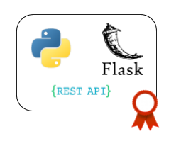

# REST APIs

<p align="center"> 
 
</p>

### Motivation ###

The world of web services has been on a fast track to supernova ever since the architect 
astronauts spotted another meme to rocket out of pragmatism and into the universe of 
enterprises. But, thankfully, all is not lost. A renaissance of HTTP appreciation is building and, under the banner of 
REST, shows a credible alternative to what the merchants of complexity are trying to ram down everyone’s throats; a simple 
set of principles that every day developers can use to connect applications in a style native to the Web.

If you have any working experience in the IT industry you should already know that web services are an everyday thing. 
Regardless of your position, the interaction with them is surely inevitable. The main purpose of this module is to focus 
on REST services and get you familiar with their development using Python and Flask.

### What you will learn ###

Web services basics and REST principles, including RESTful APIs and HTTP protocol. REST APIs development using Python 
and Flask.

### Courses ###

1. [What is an API?](https://www.youtube.com/watch?v=s7wmiS2mSXY)

2. [How to design a good API and why it matters](https://www.youtube.com/watch?v=aAb7hSCtvGw)

3. [Web Services tutorials for beginners](https://www.guru99.com/web-services-tutorial.html)

4. [What is REST?](https://www.restapitutorial.com/lessons/whatisrest.html)

5. [Introduction to REST](https://www.youtube.com/watch?v=YCcAE2SCQ6k)

6. [RESTful web services](http://restfulwebapis.org/RESTful_Web_Services.pdf)

7. [HTTP Status Codes](https://www.restapitutorial.com/httpstatuscodes.html)

8. [Flask tutorial](https://flask.palletsprojects.com/en/1.1.x/tutorial/)

### Practice ###

#### Before you begin ####

- Install Python in your local computer.

- Install Flask using the package manager of your choice.

#### Exercices ####

1. Download Postman. You will use this client to manually test your REST service.

2. Document a **shopping cart API spec** in a Google spreadsheet. Specify every possible scenario in each defined endpoint 
with their corresponding response status and bodies. This API should at least contain the following functionality:
    1. Purchase of an Item
    2. Item description (name, price, supplier, etc)
    3. Item update
    4. Item deletion
    5. Cart items list
    6. Cart checkout
    7. Cart cancellation
    
    *Check this API with a tutor before continuing to its implementation.*

3. Develop your REST API using Python and Flask. Structure your code following good practices, with proper layering 
(rest, service, repository), using DTOs for interacting with the client and returning proper HTTP responses in each case.

4. Test your whole application using *pytest*:
    1. Use any python mocking library for your tests. 
    2. Include coverage reports, reaching a 90% at least. 
    3. Include mutation tests, reaching a 90% at least.
    4. Include load and stress tests.

5. Document your API using Swagger/simil.

6. Add authentication and authorization to your app. 
    1. Item list can be requested by any user
    2. Item update and deletion can only be requested by a user with *admin* role.
    3. Cart checkout can only be applied by an authenticated user

7. Suppose that the client wants to receive the list of items with the following format:
    ```
    {
      "total": 4,
      "categories":{
          "food:" 2,
          "drinks":1,
          "bathroom":1
      },
      ... //the same with each of the product's attributes
      ,
      "data":
      [
      {
         //product1 info
        },
        {
          //product2 info
        },
        ...
      ]
    }
    ```
    Adjust your REST layer in order to return the list of products with this format.

8. Allow the user to decide how to pay cart items:
    1. with Credit Card, where a Name and a Credit Number is required.
    2. with Paypal, where an email and a password is needed.
    3. with Cash: no information is required.

9. Add the following discount depending on the payment type:
    1. 10% by Credit Card.
    2. The cheapest item is for free when the user pay by Paypal.
    3. 90% of the most expensive item is free if the user pays by Cash.

10. Add a mail list where the market manager is notified when:
    1. A new item/offer is added
    2. A price is changed
    3. A new transaction was made

### Commit ###

Commit your practice code.


### Auto assessment ###

*1. What is a web service? How can it be exposed?*

*2. Is REST a protocol?*

*3. What's the difference between SOAP and REST?*

*4. What's an API?*

*5. What's JSON? What's the difference with XML?*

*6. What's an endpoint? Can a service expose multiple endpoints?*

*7. How can I hit an endpoint?*

*8. Which are the HTTP codes families? What does each of them represent?*

*9. Which are the REST principles? Is REST stateful or stateless?*

*10. How can I document a service?*

*11. How can I secure a service? How do you maintain this security through different requests?*

*12. What should your REST service respond if:*
- a wrong payload is sent?
- the searched resource is not found?
- an unexpected error occurs in your code?
- a third-party service which your service depends on is currently down?
- the user is not allowed to make the operation?

*13. Can a service hit another service? How? What happens if my service is developed in Java and the other service is 
developed in Node?*

*14. What should I expose through my API and what should I not expose?*

*15. What is a DTO? When should I use them?*

*16. Which libraries does Python provide for handling JSON?*

*17. Can I use XML with REST?*

---

 

### *Sync to obtain your badge!*
 
Remember to sync with an Academy tutor to obtain your badge before continuing to the next module. This will also let you be sure you have acquired every needed concept. Complete the [Ending Module form](https://forms.gle/ukvWjKtoFYx4Kn8q7) before meeting with your tutor.