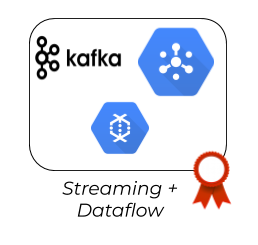

# Streaming + Dataflow

  

  

### Motivation ###
#### Streaming ####
Today data is streaming all around us, with new data sources coming online.
It is also called by names such as stream processing, real-time analytics, streaming analytics, complex event processing, real-time streaming analytics, and event processing. Although some terms historically had differences, now, tools have converged under term stream processing.

Big data established the value of insights derived from processing data. The value of such insights is not created equal. Some insights have much higher values shortly after something has happened and that value diminishes very fast with time. Stream processing targets such scenarios. The key strength of stream processing is that it can provide insights faster, often within milliseconds to seconds.

With the rise of IoT and Smart Devices, we are generating data at an unprecedented speed. With distributed computing, data is generated somewhere and processed somewhere else. Sensors or UI on devices capture some data (manual or automated) as an event and send it to some other unit for processing. This happens continuously.

#### Dataflow ####
[Cloud Dataflow](https://cloud.google.com/dataflow/) is a fully-managed service for transforming and enriching data in [stream](https://cloud.google.com/solutions/big-data/stream-analytics/) (real time) and batch (historical) pipelines written using the [Apache Beam SDK](https://beam.apache.org/).

### What you will learn ###
* Understand data streaming architecture
* Google Cloud Dataflow service Fundamentals
* Understand Apache Kafka Ecosystem, Architecture, Core Concepts and Operations
* Google Cloud Pub/Sub Fundamentals
* Know Stream Processing Frameworks 

### Streaming ###
##### Lectures ####
* [Streaming 101: The world beyond batch](https://www.oreilly.com/ideas/the-world-beyond-batch-streaming-101)
* [Streaming 102: The world beyond batch](https://www.oreilly.com/ideas/the-world-beyond-batch-streaming-102)
* [Understanding Stream Processing](readings/dzone-refcard265-streamprocessing-0523.pdf)
* [Lambda Architecture](http://lambda-architecture.net/)
* [Kappa Architecture](https://milinda.pathirage.org/kappa-architecture.com/)
##### Videos ####
* [Using PubSub Messaging Pattern](https://www.youtube.com/watch?v=gWUcW5OXTxk)

#### Kafka ###
##### Lectures ###
* Kafka Oficial documentation
	* [Apache](https://kafka.apache.org/documentation/)
	* [confluent.io](https://docs.confluent.io/current/)
##### Videos ###
* [Apache Kafka in 5 minutes](https://www.youtube.com/watch?v=PzPXRmVHMxI)
* [Understanding Kafka](https://www.youtube.com/watch?v=k-7lz6Ex354)
* [Kafka vs. Standard Messaging](https://www.youtube.com/watch?v=lwMjjTT1Q-Q&t=6s)
* Apache Kafka
	1. [Intro to Streams](https://www.youtube.com/watch?v=Z3JKCLG3VP4&t=198s)
	2. [Creating a Streams Application](https://www.youtube.com/watch?v=LxxeXI1mPKo)
	3. [Transforming Data Pt. I](https://www.youtube.com/watch?v=7JYEEx7SBuE)
	4. [Transforming Data Pt. II](https://www.youtube.com/watch?v=3kJgYIkAeHs)
* [Apache Kafka Tutorial For Beginners](https://www.youtube.com/watch?v=U4y2R3v9tlY)

#### Google Pub/Sub ###
##### Lectures ###
* [Official Documentation](https://cloud.google.com/pubsub/docs/)
* [Using Cloud Pub/Sub with Cloud Dataflow](https://cloud.google.com/pubsub/docs/pubsub-dataflow)
* [How-to guides](https://cloud.google.com/pubsub/docs/how-to)
##### Videos ###
* [Getting Started with Cloud Pub/Sub](https://www.youtube.com/watch?v=pU1zA-DMlWk)
* [Simplify Event Driven Processing with Cloud Pub/Sub](https://www.youtube.com/watch?v=oKU2wbTXMTY)

### Google Dataflow ###
#### Lectures ###
 * [Official Documentation](https://cloud.google.com/dataflow/docs/)
 * [Tutorials and samples](https://cloud.google.com/dataflow/docs/samples)
 * [Apache Beam Documentation](https://beam.apache.org/documentation/)
 * [How-to guides](https://cloud.google.com/dataflow/docs/how-to)
 * [Apache Beam Programming Guide](https://beam.apache.org/documentation/programming-guide/)
 * [Pipeline fundamentals for the Apache Beam SDKs](https://cloud.google.com/dataflow/docs/guides/beam-creating-a-pipeline)
 * [Learning Resources](https://beam.apache.org/documentation/resources/learning-resources/)
 * [Beam Capability Matrix](https://beam.apache.org/documentation/runners/capability-matrix/)
#### Videos ###
 * [Introduction to Google Cloud Dataflow](https://www.youtube.com/watch?v=1l-PBRothn0)
 * [Apache Beam and Google Cloud Dataflow](https://www.youtube.com/watch?v=ss6SaNBHLGc)
 * [Dataflow: A Unified Model for Batch and Streaming Data Processing](https://www.youtube.com/watch?v=3UfZN59Nsk8) 
 * [Overview of Apache Beam](https://www.youtube.com/watch?v=6EWt9WgAW8c)
 * Apache Beam Tutorial
	- [Part 1: Intro](https://www.youtube.com/watch?v=cpI9pDQK864)
	- [Part 2: Overview](https://www.youtube.com/watch?v=PFCndyov3kM)
	- [Part 3: Word Count Demo](https://www.youtube.com/watch?v=kSKRr5i7RHI)
	- [Part 4: Parsing Tweets](https://www.youtube.com/watch?v=rJZEvp1pfCE)
 
### Courses ###
1. [Real-Time Analytics with Apache Storm](https://www.udacity.com/course/real-time-analytics-with-apache-storm--ud381)
2. [Big Data Applications: Real-Time Streaming](https://www.coursera.org/learn/real-time-streaming-big-data)
	**Note**: You can use audit mode in order to watch the videos. 

### Recommended books / Further Readings ###
* [Real-Time Big Data Analytics: Emerging Architecture (free ebook)](https://www.oreilly.com/data/free/big-data-analytics-emerging-architecture.csp)
* [Streaming Systems](https://www.oreilly.com/library/view/streaming-systems/9781491983867/)
* Kafka The Definitive Guide
	* [confluent.io](https://www.confluent.io/resources/kafka-the-definitive-guide/)
	* [Oreilly](https://www.oreilly.com/library/view/kafka-the-definitive/9781491936153/#toc-start)

### Practice ###
### Pub/sub
* [NYC Taxi Tycoon](https://codelabs.developers.google.com/codelabs/cloud-dataflow-nyc-taxi-tycoon/#0)
* [Messaging with Spring Integration and Google Cloud Pub/Sub](https://codelabs.developers.google.com/codelabs/cloud-spring-cloud-gcp-pubsub-integration/index.html?index=..%2F..index#0)
### Dataflow
* [Codelabs - Dataflow](https://codelabs.developers.google.com/codelabs/cloud-dataflow-starter/#0)
  

#### Before you begin ####
You will solve this exercises using Apache Kafka. You are able to select [Apache](https://kafka.apache.org/) or [Confluent](https://www.confluent.io/) options 

* Setup a Single Node Kafka Cluster  (read Apache Kafka documentation)

#### Exercices ####
Consider a hypothetical fleet management company that needs a dashboard to get the insight of its day to day activities related to vehicles. Each vehicle in this fleet management company is fitted with a GPS based geolocation emitter, which emits location data containing the following information
1.  **Vehicle Id**: A unique id is given to each vehicle on registration with the company.   
2.  **Latitude and Longitude**: geolocation information of vehicle.
3.  **Availability**: The value of this field signifies whether the vehicle is available to take a booking or not.  Current Status (Online/Offline) denotes whether the vehicle is on duty or not.
    
### Functional Requirements
1.  The users should be able to know the total number of vehicles online and offline at any point of time. Feel free to use the technology you want to see the information
  

### Commit ###
Commit your practice code.

  

### Auto assessment ###

1. How you can describe Streaming in a simple words ?
2. Real time is the same than Streaming process ?
3. Could you list Kafka components. ?
4. What is Request/response pattern ?
5. How does the Publish / subscribe pattern start ? 
6. Explain the role of the offset.
7. In Kafka, What is a Consumer Group ?
8. Is it possible to use Kafka without ZooKeeper ?
9. Why are Replications critical in Kafka?  
10. What is Apache Beam? How is it related with Dataflow? Can you run Beam programs with any other tool?
11. Is Dataflow fully managed? 
12. Is Dataflow meant for batch or stream processing?
13. What are PCollections and PTransforms? Are the former always bounded? What happens if the collection does not fit in memory?
14. What is ParDo? Where is the associated code executed? Does it contain state?
15. What are side inputs? How do you create them in Python? Is it different in Java?
16. Can you explain the concept of beam windowing? Which types of windowing are there?
17. Can you compare Dataflow with Dataproc? (take into account servers, migrations, required team). When would you choose the former and when the latter?
18. GroupByKey vs Combine. What are the differences?
19. What are Dataflow templates? Can you mention some examples?
20. Cloud Dataprep. How is it related with Cloud Dataflow?

---

  

### *Sync to obtain your badge!*
Remember to sync with an Academy tutor to obtain your badge before continuing to the next module. This will also let you be sure you have acquired every needed concept. Complete the [Ending Module form](https://forms.gle/ukvWjKtoFYx4Kn8q7) before meeting with your tutor.
